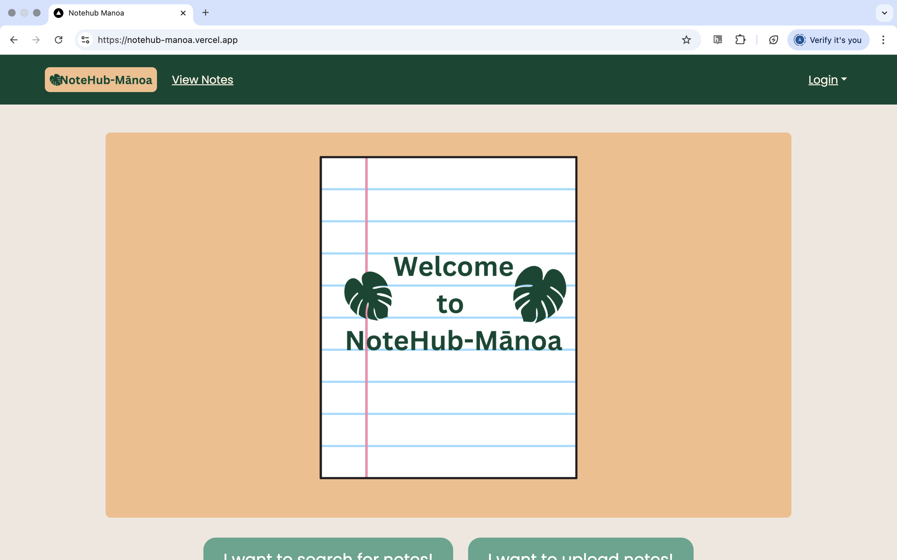

# NoteHub-Mānoa

## Table of Contents

* [Overview](#overview)
* [Deployment](#deployment)
* [User Guide](#user-guide)
* [Community Feedback](#community-feedback)
* [Developer Guide](#developer-guide)
* [Development History](#development-history)
* [Development](#development)
* [Continuous Integration](#continuous-integration)
* [Figma Mockup](#figma-mockups)
* [Walkthrough Videos](#walkthrough-videos)
* [Example Enhancements](#example-enhancements)
* [Team Contract](https://docs.google.com/document/d/1IHEfQtw1nb9-c-XlJGUT-TiZKemAvDFH050V7u3n5Wg/edit?tab=t.0)

---

## Overview

NoteHub-Mānoa is a collaborative platform designed for UH Mānoa students to share, rate, and discuss lecture notes by course, semester, and professor. The app aims to reduce the stress of scrambling for study material before exams by building a community-driven library of class notes.

It provides the following core features:

* Upload and access class notes across UH Mānoa courses.
* Filter notes by **course**, **professor**, and **semester**.
* Comment and discuss uploaded notes with peers.
* Rate notes on a 5-star scale based on usefulness.
* Points-based system to encourage high-quality contributions.

NoteHub-Mānoa is built by students, for students—fostering an academic ecosystem of collaboration and clarity.

---

## Deployment

The current deployment is managed through GitHub Pages and is available at:  
**[https://notehub.github.io](https://notehub.github.io)** (pending GitHub Pages activation and repo setup)

---

## User Guide

This section outlines typical user interactions with NoteHub-Mānoa.

### Landing Page

The landing page introduces the app and provides login/register options.

### Uploading Notes

1. Log in or create an account.
2. Click on the **Upload Notes** button in the nav bar.
3. Complete the following fields:
   - Title
   - Department and Class
   - Semester
   - Professor
   - Description
   - Link to Notes (e.g., Google Drive, GitHub)
   - Optional: Owner Email (defaults to anonymous)
4. Submit to publish the note listing.

### Editing Notes

1. Log in and click on **Edit Notes** (visible only to users who have uploaded notes).
2. View a list of your uploads.
3. Select a note to update.
4. Modify any field and resubmit.
5. Changes are reflected immediately on the View Notes page.

### Searching for Notes

1. Visit the **View Notes** page.
2. Use the search bar to filter by:
   - Course
   - Professor
   - Semester
3. Browse notes with metadata including:
   - Author
   - Document Link
   - Course Details
   - Rating
   - Description

---

## Community Feedback

###  Comment Section

Each note has an attached comment section for questions, feedback, and discussion between users and the note owner.

###  Rating System

- Notes are rated from 1–5 stars.
- Average ratings are displayed on the note listing.
- Users **must rate notes** after viewing.

---

## Developer Guide

### Points-Based System

- Users earn points when their notes are rated.
- Higher ratings earn more points.
- Accessing highly-rated notes costs more points.
- This rewards quality note-taking and discourages freeloading.

---

## Development History

The project originated from a shared problem UH Mānoa students faced: scattered, low-quality, or inaccessible notes. The idea emerged from real conversations between students trying to prep for exams using incomplete or disorganized materials.

---

## Development

Deployed application running on Vercel at [Note-Hub Manoa](https://notehub-manoa.vercel.app)

---

## Continuous Integration

CI/CD pipelines will be implemented to automate testing and ensure smooth deployment. Currently managed manually via GitHub Pages settings.

---
## Figma Mockups

[Figma Mockup](https://www.figma.com/design/gn3wSQTofguqx5eSH5CgOW/ICS-314-Final?node-id=0-1&p=f)

---

## Walkthrough Videos

Landing Page

Upload Notes Page

Successfully Uploaded Note Page

Comments Page

Sign Out Page

---

## Milestones

**[M1](https://github.com/orgs/web-warriors-hub/projects/1/views/1)**
**[M2](https://github.com/orgs/web-warriors-hub/projects/7)**

---

## Example Enhancements

- Email notifications for comments.
- Integration with UH accounts.
- PDF preview of notes before opening.
- AI-generated summaries or tags for uploaded notes.

---

## Team

- **Catalina** 
- **Nalani**
- **Andrea**  
- **Milan**    
- **Landon**    

Our Team Contract can be found [here](https://docs.google.com/document/d/1IHEfQtw1nb9-c-XlJGUT-TiZKemAvDFH050V7u3n5Wg/edit?tab=t.0)
