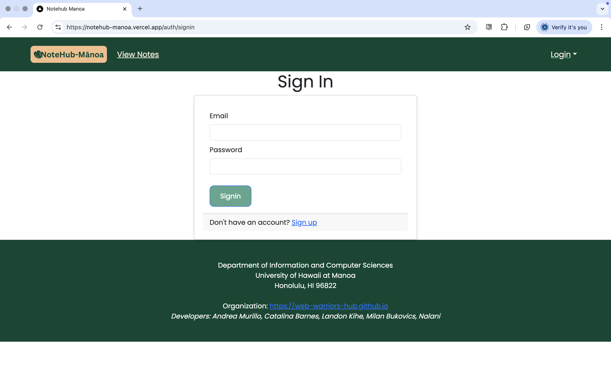
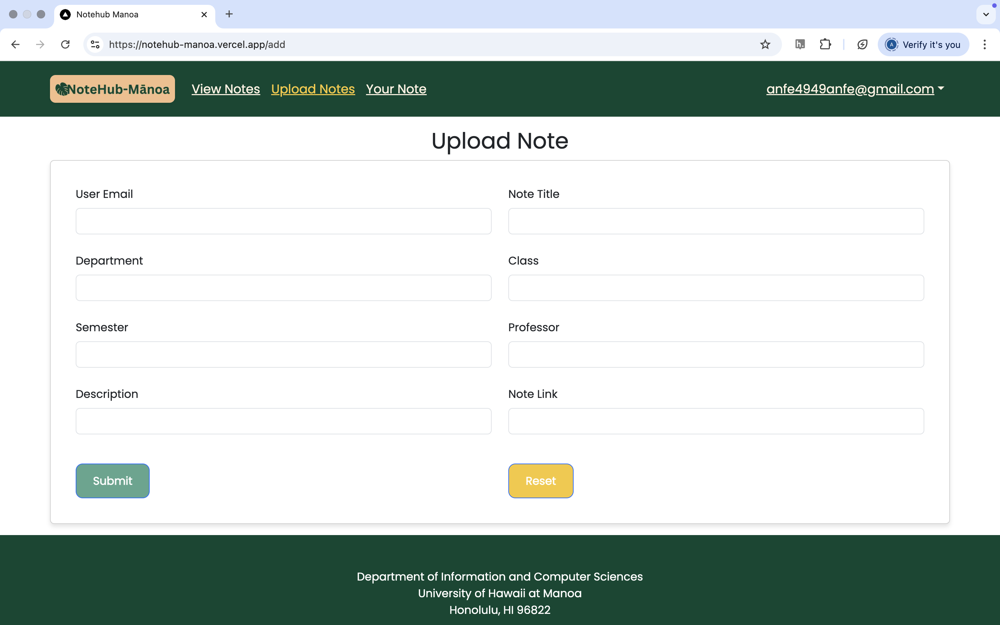

# NoteHub-Mﾄ］oa

[](https://github.com/web-warriors-hub/notehub-manoa/actions)

## Table of Contents

- [Overview](#overview)
- [User Guide](#user-guide)
- [Community Feedback](#community-feedback)
- [Developer Guide](#developer-guide)
- [Development History](#development-history)
- [Contact Us](#contact-us)
- [Deployment](#deployment)
- [Continuous Integration](#continuous-integration)
- [Figma Mockups](#figma-mockups)
- [Walkthrough Videos](#walkthrough-videos)
- [Milestones](#milestones)
- [Example Enhancements](#example-enhancements)

---

## Overview

[NoteHub-Mﾄ］oa](https://github.com/web-warriors-hub/web-warriors-hub.github.io) is a collaborative platform created by and for UH Mﾄ］oa students to share, search, and rate lecture notes. It addresses the common stress students face when preparing for exams without reliable study materials. What makes it unique:

- Every student can upload their own notes
- Filtering by **course**, **professor**, and **semester**
- Ability to access notes from previous semesters

NoteHub-Mﾄ］oa is more than a file-sharing app窶琶t's a student-built ecosystem for academic support.

---

## User Guide

### Landing Page
Provides a quick introduction and options to log in or register.


### View All Notes
- Filter and browse all shared notes without the need of signing in


### Sign In / Sign Up
- Secure authentication for access to full features.



### Upload Notes
Steps:
1. Log in
2. Click "Upload Notes"
3. Fill in note details (title, class, semester, professor, description, link)
4. Submit to share

  


### View Notes
- Filter and browse all shared notes
- Access note details, and download links


### Manage Your Notes
- View, edit, and delete previously uploaded notes


#### Edit Page


#### Delete Page

---

## Community Feedback

TODO

---

## Developer Guide

### Local Development

To run NoteHub-Mﾄ］oa locally:

```bash
git clone https://github.com/web-warriors-hub/notehub-manoa.git
cd notehub-manoa
npm install
npm run dev
```

### Deployment

We use [Vercel](https://notehub-manoa.vercel.app) for deployment. You can also deploy using GitHub Pages. Adjust the base path as needed in `next.config.js`.

### Technologies Used

- Next.js
- Vercel
- Bootstrap
- PgAdmin
- Postgres
- GitHub Actions for CI/CD

---

## Development History

### Milestone 1
[M1 Project Board](https://github.com/orgs/web-warriors-hub/projects/1/views/1)
- Ideation and wireframes
- Team contract and initial planning

### Milestone 2
[M2 Project Board](https://github.com/orgs/web-warriors-hub/projects/7)
- Frontend pages and form logic
- Firebase integration for auth and storage

### Milestone 3
[M3 Project Board](https://github.com/orgs/web-warriors-hub/projects/8)
- Comment and rating system
- Points-based access control
- Community feedback integration
- Final UI polish and deployment

---

## Contact Us

### Developers
- [Catalina](https://github.com/cat-mb)  
- [Andrea](https://github.com/andreamurillomtz)  
- [Milan](https://github.com/milanbukovics)  
- [Landon](https://github.com/lkihe)  
- [Nalani](https://github.com/NalaniKlopfen)  

Have questions, feedback, or want to collaborate?  
📩 [Open an issue on GitHub](https://github.com/web-warriors-hub/notehub-manoa/issues)  

Team Contract: [Link](https://docs.google.com/document/d/1IHEfQtw1nb9-c-XlJGUT-TiZKemAvDFH050V7u3n5Wg/edit?tab=t.0)

---

## Deployment

- Live Vercel App: [notehub-manoa.vercel.app](https://notehub-manoa.vercel.app)
- GitHub: [notehub.github.io](https://notehub.github.io)

---

## Continuous Integration

GitHub Actions automates lint checks and tests on every push. Future CI will include deployment and E2E testing.

---

## Figma Mockups

[View Mockups](https://www.figma.com/design/gn3wSQTofguqx5eSH5CgOW/ICS-314-Final?node-id=0-1&p=f)

---

## Example Enhancements

- UH Account Integration (SSO)
- AI-generated note summaries
- PDF previews before download
- Email alerts for new notes in your classes
- Gamification of notes     
